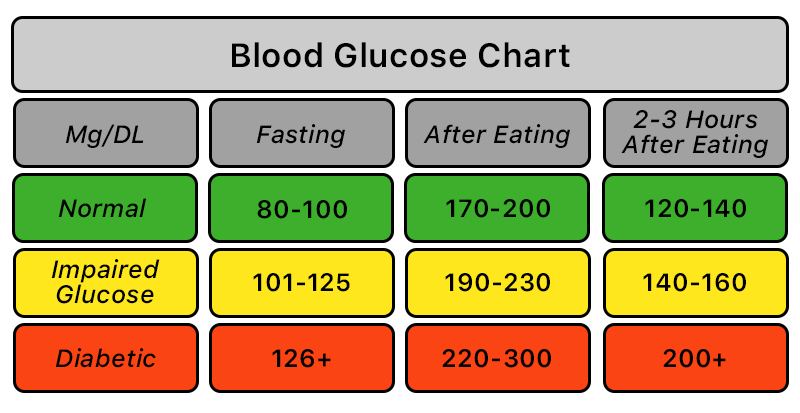

```{r setup, include=FALSE}

rm(list = ls())

knitr::opts_chunk$set(echo = TRUE,warning = FALSE, message = FALSE)

pacman::p_load(tidyverse,icd,knitr,kableExtra,finalfit,lubridate,data.table,
               janitor,flextable,survival,survminer,rmdHelpers, ggrepel,
               scales,RColorBrewer,GGally,randomForest, caret,DT, gtsummary,cardx,
               ggsurvfit,mice)

```

## Formatting Data {.tabset .tabset-fade .tabset-pills}

### First look at the data

```{r loading in data}
stroke_data <- read_csv("healthcare-dataset-stroke-data.csv")
```

```{r looking at the data}
str(stroke_data)
```

```{r checking overall dataset summarys stats and missingess}
ff_glimpse(stroke_data)
```

```{r removing children from the dataset and format binary variables}

#Removing children as lifestyle factors will be far less connected to pediatric stroke - https://www.stroke.org.uk/stroke/childhood/about #

#No.rows with children#
print(paste("The number of rows of the data with children included -", nrow(stroke_data)))

#Removing children by filtering out all rows with age<18#
children <- stroke_data %>% filter(age < 18)

print(paste("The number of rows of the data that are children (age<18) -", nrow(children)))

stroke_data <- stroke_data %>% filter(age >= 18)

print(paste("The number of rows of the data without children included -", nrow(stroke_data)))

#Creating yes/no (yn) versions of the binary outcome variables#
stroke_data$hypertension_yn <- as.factor(ifelse(stroke_data$hypertension == 1, "Yes", "No"))
stroke_data$heart_disease_yn <- as.factor(ifelse(stroke_data$heart_disease == 1, "Yes", "No"))
stroke_data$stroke_yn <- as.factor(ifelse(stroke_data$stroke == 1, "Yes", "No"))

#re-leveling above yn variables to have "No" as the default and adding ff_label command for cleaner formatting in finalfit plots#

stroke_data <- stroke_data %>% mutate(
  hypertension_yn = relevel(factor(hypertension_yn), ref = "No") %>% 
    ff_label("Hypertension (Yes/No)"),
  
  heart_disease_yn = relevel(factor(heart_disease_yn), ref = "No") %>% 
    ff_label("Heart Disease (Yes/No)"),
  
  stroke_yn = relevel(factor(stroke_yn), ref = "No") %>% 
    ff_label("Stroke (Yes/No)")
)

```

```{r adding follow up time for survival analysis}
set.seed(123)  # For reproducibility

# Simulate follow-up times in days
stroke_data <- stroke_data %>% 
  mutate(
    follow_up_time_days = runif(n(), min = 0, max = 1825),  # Time between 0 and 5 years for all
    # Assume the event occurs within the observed time or they are censored
    status = ifelse(stroke == 1, 1, 0)  # 1 = event (stroke), 0 = censored (no stroke)
  )

# Making up a follow up time in years
stroke_data <- stroke_data %>%
  mutate(
    follow_up_time_days = as.numeric(follow_up_time_days),  # Replace with your column name
    follow_up_years = follow_up_time_days / 365         # Convert days to years
  )

# Show sample data with follow-up time in days
head(stroke_data)

datatable(stroke_data[1:10, ],options = list(scrollX = TRUE))
```

```{r making categorical variables of numeric variables}
stroke_data$bmi <- as.numeric(stroke_data$bmi)

stroke_data <- stroke_data %>% mutate(
  # Create age categories
  age_category = case_when(
    age < 18 ~ "<18",
    age >= 18 & age <= 35 ~ "18-35",
    age > 35 & age <= 60 ~ "36-60",
    age > 60 ~ ">60"
  ) %>% factor(levels = c("<18", "18-35", "36-60", ">60")),
  
  # Create BMI categories
  bmi_category = case_when(
    bmi < 18.5 ~ "Underweight",
    bmi >= 18.5 & bmi <= 24.9 ~ "Normal weight",
    bmi >= 25 & bmi <= 29.9 ~ "Overweight",
    bmi >= 30 ~ "Obese",
    TRUE ~ NA_character_
  ) %>% factor(levels = c("Underweight", "Normal weight", "Overweight", "Obese"))
  
)
  
```


### Handling Missingness

```{r checking missingness again after making variables numeric}
ff_glimpse(stroke_data)
```

```{r checking missingness in the bmi category variable }
# Check how many NAs are in the categorical variable and inspect its unique values
na_categorical_count <- sum(is.na(stroke_data$bmi_category))
cat("Number of NAs in categorical BMI variable:", na_categorical_count, "\n")

# View unique BMI category values
unique(stroke_data$bmi_category)
```

There are 181 NAs in the original 'bmi' variable. These didn't show up in the first 
usage of ff_glimpse() as the variable was a *character* type, so N/A and a numeric 
value were treated the same. A second usage of ff_glimpse() shows the 181 NAs, 
which of course are then carried on to the categorical variable when that is made.

```{r missing values plot}
explanatory <- c("bmi","gender","age","hypertension_yn","heart_disease_yn","ever_married",
                 "work_type","residence_type","smoking_status")
dependent <- "stroke_yn"

stroke_data %>% 
  missing_plot(dependent, explanatory)
```

There are different types of missingness:

-   **MCAR (Missing Completely at Random)** - "Missing data values do not relate 
to any other data in the dataset and there is no pattern to the actual values of the missing data themselves."

-   **MAR (Missing at Random)** - "This is confusing and would be better named 
*missing conditionally at random*. Here, missingness in a particular variable has 
an association with one or more other variables in the dataset. However, 
the actual values of the missing data are random."

-   **MNAR (Missing not at random)** - "The pattern of missingness is related to 
other variables in the dataset, but in addition, *the actual values of the missing data are not random*."

Fo example, in a different dataset, smoking status would be missing in females 
more likely to smoke but not in males.

"Thus, the complete case female patients have different characteristics to the 
missing data female patients. For instance, the missing data female patients may 
be more likely to die after cancer treatment. Looking at our available population,
***we therefore under estimate the likelihood of a female dying from cancer treatment***."

"In deciding whether data is MCAR or MAR, one approach is to explore patterns of 
missingness between levels of included variables. This is particularly 
important...for a primary outcome measure / dependent variable.

Take for example “death”. When that outcome is missing it is often for a particular 
reason. For example, perhaps patients undergoing emergency surgery were less likely 
to have complete records compared with those undergoing planned surgery. 
And of course, death is more likely after emergency surgery."

```{r looking for patterns of missingness}

stroke_data %>% 
  missing_pattern(dependent, explanatory)

```

```{r checking for associations between missing and observed data part 1}
explanatory <- c("bmi","gender","hypertension_yn","ever_married")
dependent <- "stroke_yn"

stroke_data %>% 
  missing_pairs(dependent, explanatory, position = "fill")

```

```{r checking for associations between missing and observed data part 2}
explanatory <- c("bmi","work_type","residence_type","smoking_status")
dependent <- "stroke_yn"

stroke_data %>% 
  missing_pairs(dependent, explanatory, position = "fill")

```

```{r checking for associations between missing and observed data part 3}
explanatory <- c("bmi","heart_disease_yn","age")
dependent <- "stroke_yn"

stroke_data %>% 
  missing_pairs(dependent, explanatory, position = "fill")

```

Looking at the above 3 plots, the following can be observed: 

* There is more missingness for the BMI variable in those patients who have stroke than those who do not.

* There is also slightly more missingness in those with hypertension than those patients without it.

* In those patients with heart disease and an average older patients , there is also more BMI missingness. 

* Given the above info., we can start to conclude that the BMI variable missingness is MAR - *missingness in a particular variable that has an association with one or more other variables in the dataset*.

The relevant variables that have an association with missingness in bmi are selected for a single missing pairs plot below.

```{r generating a missing pairs plot of associated variables strokeyn heartdisease hypertension age}

explanatory <- c("bmi","heart_disease_yn","hypertension_yn","age")
dependent <- "stroke_yn"

stroke_data %>% 
  missing_pairs(dependent, explanatory, position = "fill")

```


```{r generating necessary factor variables}

#gender#
stroke_data$gender <- as.factor(stroke_data$gender)

summary(stroke_data$gender)

#ever_married#

stroke_data$ever_married <- as.factor(stroke_data$ever_married)

summary(stroke_data$ever_married)

#work_type#
stroke_data$work_type <- as.factor(stroke_data$work_type)

summary(stroke_data$work_type)

#residence_type#
stroke_data$residence_type <- as.factor(stroke_data$residence_type)

summary(stroke_data$residence_type)

#smoking_status#
stroke_data$smoking_status <- as.factor(stroke_data$smoking_status)

summary(stroke_data$smoking_status)

```

In the gender and work_type variables there are factor levels with minuscule values 
- 'Other' in gender with 1 and 'Never_worked' in work_type with 5. These numbers 
are extremely small and likely to disturb further analysis so I'll make them NA 
so as to not lose the patients but not have the awkward category either. 


```{r making nas from and dropping factor levels with too little in them}

stroke_data$gender[stroke_data$gender == "Other"] <- NA

stroke_data$work_type[stroke_data$work_type == "Never_worked"] <- NA

stroke_data$gender <- droplevels(stroke_data$gender)

stroke_data$work_type <- droplevels(stroke_data$work_type)


summary(stroke_data$gender)

summary(stroke_data$work_type)

```


### MICE on MAR BMI 

Multivariate Imputation by Chained Equations (mice) is 
"*...the process of filling in missing data using a best-estimate from all the other data that exists.*" 
(Section 11.8.1 of the HealthyR book)

If missingness in BMI is predicted strongly by stroke outcome (and other observed variables),
and the values of the missing data are random, then we can impute (best-guess) 
the missing BMI values using those variables.

"*Imputation is not usually appropriate for the explanatory variable of interest or the outcome variable, although these can be used to impute other variables. In both cases, the hypothesis is that there is a meaningful association with other variables in the dataset, therefore it doesn’t make sense to use these variables to impute them.*"

The multiple imputation process is as follows:

* **Impute** missing data *m* times, resulting in *m* complete datasets.

* **Diagnose** the quality of the impute values.

* **Analyse** each completed dataset.

* **Pool** the results of the reported analyses.

#### Impute

```{r choosing variables to be imputed and be used in imputation}

explanatory <- c("id","bmi","gender","age","hypertension_yn","heart_disease_yn","ever_married",
                 "work_type","residence_type","smoking_status")
dependent <- "stroke_yn"

#Choosing variables to not be imputed but still used by the mice function# 
stroke_data %>% 
  select(dependent, explanatory) %>% 
  missing_predictorMatrix(
    drop_from_imputed = c("gender","age","hypertension_yn","heart_disease_yn","ever_married",
                 "work_type","residence_type","smoking_status","stroke_yn","id"),
    drop_from_imputer = c("gender","ever_married","work_type","residence_type","smoking_status",
                          "id")
  ) -> predM
```

```{r make 10 imputed datasets and run our logistic regression analysis on each set }
fits <- stroke_data %>% 
  select(dependent, explanatory) %>% 
  
  # Run imputation with 10 imputed sets
  mice(m = 10, predictorMatrix = predM) %>% 
  
  # Run logistic regression on each imputed set
  with(glm(formula(ff_formula(dependent, explanatory)), 
           family="binomial"))
```

#### Diagnose

```{r extracting aics}
# Examples of extracting metrics from fits and taking the mean
## AICs
fits %>% 
  getfit() %>% 
  purrr::map(AIC) %>%
  unlist() %>% 
  mean()
```

```{r obtaining the c statistic}
# C-statistic
fits %>% 
  getfit() %>% 
  purrr::map(~ pROC::roc(.x$y, .x$fitted)$auc) %>% 
  unlist() %>% 
  mean()
```

#### Analyse

```{r pool the results of the model and visualise in an or plot}
# Pool results
fits_pool <- fits %>% 
  pool()

## Can be passed to or_plot
stroke_data %>% 
  or_plot(dependent, explanatory, glmfit = fits_pool, table_text_size=4)
```

#### Pool

```{r summarise log reg models that do not have and have imputed bmi}
# Summarise and put in table
fit_imputed <- fits_pool %>%                                  
  fit2df(estimate_name = "OR (multiple imputation)", exp = TRUE)

# Use finalfit merge methods to create and compare results
explanatory <- c("bmi","gender","age","hypertension_yn","heart_disease_yn","ever_married","work_type","residence_type","smoking_status")

table_uni_multi <- stroke_data %>% 
  finalfit(dependent, explanatory, keep_fit_id = TRUE) 

explanatory = c("gender","age","hypertension_yn","heart_disease_yn","ever_married","work_type","residence_type","smoking_status")

fit_multi_no_bmi <- stroke_data %>% 
  glmmulti(dependent, explanatory) %>% 
  fit2df(estimate_suffix = " (multivariable without BMI)") 

# Combine to final table
table_imputed <- 
  table_uni_multi %>% 
  ff_merge(fit_multi_no_bmi) %>% 
  ff_merge(fit_imputed, last_merge = TRUE)

table_imputed 
```

#### Generating Data & Adding Imputed Values to Original Dataset

```{r doing mice again to save and extract the data}
explanatory <- c("id","bmi","gender","age","hypertension_yn","heart_disease_yn","ever_married",
                 "work_type","residence_type","smoking_status")
dependent <- "stroke_yn"

stroke_data %>% 
  select(dependent, explanatory) %>% 
  missing_predictorMatrix(
    drop_from_imputed = c("gender","age","hypertension_yn","heart_disease_yn","ever_married",
                 "work_type","residence_type","smoking_status","stroke_yn","id"),
    drop_from_imputer = c("gender","ever_married","work_type","residence_type","smoking_status",
                          "id")
  ) -> predM

fits <- stroke_data %>%
select(dependent, explanatory) %>%
mice(m = 10, predictorMatrix = predM)


completedData <- complete(fits, action = 1)
```


```{r scatterplot of original and imputed data}
#scatter plot of original and imputed data with the magenta points being the imputed data points and the blue points being the observed values#

xyplot(fits,bmi ~ age,pch=18,cex=1)
```

The above is a scatter plot of original and imputed data with the magenta points 
being the imputed data points and the blue points being the observed values. 
The matching shape is a good verification of the imputed values indeed being plausible.

```{r density plot of observed and imputed values }
densityplot(fits)
```

The density of the imputed data for each imputed dataset is magenta and 
the density of the observed data is blue. Again, we expect the distributions to be similar.


```{r extracting id and bmi and limiting to just ids wo valid bmi}

ids_wo_bmi <- stroke_data %>% filter(is.na(bmi))

ids_wo_bmi <- ids_wo_bmi$id

imputed_bmi_values <- completedData %>% select(id, bmi)

imputed_bmi_values <- imputed_bmi_values %>% filter(id %in% ids_wo_bmi)
```

```{r adding imputed bmi values back to stroke data df}

stroke_data <- stroke_data %>%
  left_join(imputed_bmi_values, by = "id", suffix = c("", ".new")) %>%
  mutate(bmi = coalesce(bmi, bmi.new)) %>%
  select(-bmi.new)
```

```{r redoing the bmi category variable based on imputed data}

stroke_data <- stroke_data %>% mutate(
  
  # Create BMI categories
  bmi_category = case_when(
    bmi < 18.5 ~ "Underweight",
    bmi >= 18.5 & bmi <= 24.9 ~ "Normal weight",
    bmi >= 25 & bmi <= 29.9 ~ "Overweight",
    bmi >= 30 ~ "Obese",
    TRUE ~ NA_character_
  ) %>% factor(levels = c("Underweight", "Normal weight", "Overweight", "Obese"))
  
)
  
```

```{r double check missingness has been sorted}
ff_glimpse(stroke_data)

```

### Removing Blood Glucose Variable

The average glucose level variable can be considered redundant or less informative 
for exploratory data analysis (EDA) without additional context about when the readings were taken.

Glucose levels can fluctuate significantly based on factors such as fasting status, 
recent meals, and time of day. For example, a reading taken shortly after eating 
will typically be higher than a fasting reading -

```{r blood glucose chart,  fig.cap="Blood Glucose Chart from 'Lark Health' "}

```

Without knowing the conditions under which the glucose levels were measured, 
it becomes difficult to draw meaningful conclusions or identify trends during EDA. 
A reading labeled as "normal" may not actually reflect the patient’s metabolic health.

```{r removing glucose level variable from dataset and looking at data types of dataset}
stroke_data <- stroke_data %>% select(-avg_glucose_level)

str(stroke_data)

datatable(stroke_data[1:10, ],options = list(scrollX = TRUE))
```


## Exploratory Data Analysis - Summary Statistics {.tabset .tabset-fade .tabset-pills}

### Age

```{r}
#dropping children from age category#

stroke_data$age_category <- droplevels(stroke_data$age_category)

summary(stroke_data$age_category)

```


Summary statistics for age -

```{r summary statistics for the age variable}

summary(stroke_data$age)

```

-   From the summary statistics we see that the mean and median are 50.2 years 
and 50.5 years respectively. This is an indication of the age variable being normally distributed.

-   The minimum age is 18 as per the earlier filtering removing all children. 
The maximum age of a patient is 82.

```{r counting the numbers and proportions of patients in the three different age categories}
age_counts <- stroke_data %>%
  group_by(age_category) %>%
  summarise(patient_count = n()) %>%
  mutate(percentage = (patient_count / sum(patient_count)) * 100,
        percentage = signif(percentage, 3)) %>%
  arrange(age_category)

age_counts_table <- age_counts %>% rename("Percentage (%)" = percentage) %>% rename(
"No.Patients" = patient_count) %>% rename("Age Category" = age_category)

flextable(age_counts_table)

```

```{r plotting distribution of patients across age categories}
ggplot(age_counts, aes(x = age_category, y = patient_count)) +
  geom_col(fill = "blue", alpha = 0.8) +
  geom_text(aes(label = patient_count), vjust = -0.5, size = 3.5, color = "darkblue") +
  scale_y_continuous(labels = comma) +
  labs(title = "Number of Patients by Age Category",
       x = "Age Category",
       y = "Number of Patients") +
  theme_minimal() +
  theme(
    plot.title = element_text(size = 16, face = "bold"),
    plot.subtitle = element_text(size = 12),
    axis.title.x = element_text(size = 12, face = "bold"),
    axis.title.y = element_text(size = 12, face = "bold"),
    axis.text.x = element_text(hjust = 1),
    panel.grid.major = element_line(size = 0.1, linetype = 'dotted'),
    panel.grid.minor = element_blank()
  ) 

```

The above bar chart is further confirmation that the age variable is indeed normally distributed.

```{r making an age counts table stratified by stroke yes or no}
age_counts_w_stroke <- stroke_data %>%
  group_by(age_category,stroke_yn) %>%
  summarise(patient_count = n()) %>%
  mutate(percentage = (patient_count / sum(patient_count)) * 100,
                 percentage = signif(percentage, 3)) %>%
  arrange(age_category)

age_counts_w_stroke_table <- age_counts_w_stroke %>% rename("Percentage (%)" = percentage) %>% rename(
"No.Patients" = patient_count) %>% rename("Age Category" = age_category) %>% rename("Stroke (Yes/No)" = stroke_yn)

flextable(age_counts_w_stroke_table)
```

The table above displaying the no.patients in each age category stratified by 
those having or not having a stroke shows that the no.patients having a stroke 
is heavily skewed towards the oldest age category. 13.6% of patients in the 
\>60 age category had a stroke, 3.62% of patients in the 36-60 age category had a stroke, 
and just 1 patients/0.0959% of patients in the 18-35 age category had a stroke.

```{r plotting distribution of patients across age and stroke categories}
ggplot(age_counts_w_stroke, aes(x = age_category, y = patient_count, fill = stroke_yn)) +
  geom_col(position = "dodge", alpha = 0.8) +
  geom_text(aes(label = patient_count), 
            position = position_dodge(width = 0.9), 
            vjust = -0.5, size = 3.5) +
  scale_y_continuous(labels = scales::comma) +
  labs(title = "Number of Patients by Age Category and Stroke Status",
       x = "Age Category",
       y = "Number of Patients",
       fill = "Stroke") +
  theme_minimal() +
  theme(
    plot.title = element_text(size = 16, face = "bold"),
    plot.subtitle = element_text(size = 12),
    axis.title.x = element_text(size = 12, face = "bold"),
    axis.title.y = element_text(size = 12, face = "bold"),
    axis.text.x = element_text(hjust = 1),
    panel.grid.major = element_line(size = 0.1, linetype = 'dotted'),
    panel.grid.minor = element_blank()
  )

```

### BMI

Summary statistics for BMI -

```{r summary statistics for the bmi variable}

#summary statistics for bmi#

summary(stroke_data$bmi)

```

-   From the summary statistics we see that the mean and median BMIs are 29.2 and 
30.4 respectively. This is an indication of the BMI variable being normally distributed. 
The maximum and minimum BMI values of 11.3 and 92 are way beyond any conceivable measurements 
and so may be outliers that need to be removed. There are 181 NAs out of 4,254 observations.

```{r counting the numbers and proportions of patients in the four different bmi categories}
bmi_counts <- stroke_data %>%
  group_by(bmi_category) %>%
  summarise(patient_count = n()) %>%
  mutate(percentage = (patient_count / sum(patient_count)) * 100,
        percentage = signif(percentage, 3)) %>%
  arrange(bmi_category)

bmi_counts_table <- bmi_counts %>% rename("Percentage (%)" = percentage) %>% rename(
"No.Patients" = patient_count) %>% rename("BMI Category" = bmi_category)

flextable(bmi_counts_table)

```

The above table shows that this dataset has the vast majority of patients as 
overweight and obese, with only 20.3% at a normal, healthy BMI.

```{r plotting distribution of patients across bmi categories}
#Code to remove NAs from bmi_counts#

bmi_counts <- bmi_counts %>% filter(!is.na(bmi_category))


ggplot(bmi_counts, aes(x = bmi_category, y = patient_count)) +
  geom_col(fill = "blue", alpha = 0.8) +
  geom_text(aes(label = patient_count), vjust = -0.5, size = 3.5, color = "darkblue") +
  scale_y_continuous(labels = comma) +
  labs(title = "Number of Patients by BMI Category",
       x = "BMI Category",
       y = "Number of Patients") +
  theme_minimal() +
  theme(
    plot.title = element_text(size = 16, face = "bold"),
    plot.subtitle = element_text(size = 12),
    axis.title.x = element_text(size = 12, face = "bold"),
    axis.title.y = element_text(size = 12, face = "bold"),
    axis.text.x = element_text(hjust = 1),
    panel.grid.major = element_line(size = 0.1, linetype = 'dotted'),
    panel.grid.minor = element_blank()
  ) 

```

The distribution of patients is left skewed towards the 'Overweight' and 'Obese' categories.

```{r making an bmi counts table stratified by stroke yes or no}
bmi_counts_w_stroke <- stroke_data %>%
  group_by(bmi_category,stroke_yn) %>%
  summarise(patient_count = n()) %>%
  mutate(percentage = (patient_count / sum(patient_count)) * 100,
                 percentage = signif(percentage, 3)) %>%
  arrange(bmi_category)

bmi_counts_w_stroke_table <- bmi_counts_w_stroke %>% rename("Percentage (%)" = percentage) %>% rename(
"No.Patients" = patient_count) %>% rename("BMI Category" = bmi_category) %>% rename("Stroke (Yes/No)" = stroke_yn)

flextable(bmi_counts_w_stroke_table)
```

The above summary table shows the percentage of patients having a stroke is higher 
in the 'Overweight' and 'Obese' BMI categories than in the 'Normal Weight' and 'Underweight' categories.

```{r plotting distribution of patients across bmi and stroke categories}

bmi_counts_w_stroke <- bmi_counts_w_stroke %>% filter(!is.na(bmi_category))

ggplot(bmi_counts_w_stroke, aes(x = bmi_category, y = patient_count, fill = stroke_yn)) +
  geom_col(position = "dodge", alpha = 0.8) +
  geom_text(aes(label = patient_count), 
            position = position_dodge(width = 0.9), 
            vjust = -0.5, size = 3.5) +
  scale_y_continuous(labels = scales::comma) +
  labs(title = "Number of Patients by BMI Category and Stroke Status",
       x = "BMI Category",
       y = "Number of Patients",
       fill = "Stroke") +
  theme_minimal() +
  theme(
    plot.title = element_text(size = 16, face = "bold"),
    plot.subtitle = element_text(size = 12),
    axis.title.x = element_text(size = 12, face = "bold"),
    axis.title.y = element_text(size = 12, face = "bold"),
    axis.text.x = element_text(hjust = 1),
    panel.grid.major = element_line(size = 0.1, linetype = 'dotted'),
    panel.grid.minor = element_blank()
  )

```

There is a higher rate of stroke associated with the 'Overweight' and 'Obese' 
BMI categories but perhaps not a significant level.

### Gender

```{r counting the numbers and proportions of patients by gender}
gender_counts <- stroke_data %>%
  group_by(gender) %>%
  summarise(patient_count = n()) %>%
  mutate(percentage = (patient_count / sum(patient_count)) * 100,
        percentage = signif(percentage, 3)) %>%
  arrange(gender)

gender_counts_table <- gender_counts %>% rename("Percentage (%)" = percentage) %>% rename(
"No.Patients" = patient_count) %>% rename("Gender" = gender)

flextable(gender_counts_table)

```

The cohort is majority female at 60.6% and 39.4% male. One patient is marked as 'other'. 
It is unclear what this means - an input mistake, transgender? To not disturb any other modelling, this patient is removed.

```{r removing the one patient who has gender as other}

stroke_data <- stroke_data %>% filter(gender == "Male" | gender == "Female")

```

```{r plotting distribution of patients across the genders}
#redoing gender counts to reflect removed 'other' patient'
gender_counts <- stroke_data %>%
  group_by(gender) %>%
  summarise(patient_count = n()) %>%
  mutate(percentage = (patient_count / sum(patient_count)) * 100,
        percentage = signif(percentage, 3)) %>%
  arrange(gender)

ggplot(gender_counts, aes(x = gender, y = patient_count)) +
  geom_col(fill = "blue", alpha = 0.8) +
  geom_text(aes(label = patient_count), vjust = -0.5, size = 3.5, color = "darkblue") +
  scale_y_continuous(labels = comma) +
  labs(title = "Number of Patients by Gender",
       x = "Gender",
       y = "Number of Patients") +
  theme_minimal() +
  theme(
    plot.title = element_text(size = 16, face = "bold"),
    plot.subtitle = element_text(size = 12),
    axis.title.x = element_text(size = 12, face = "bold"),
    axis.title.y = element_text(size = 12, face = "bold"),
    axis.text.x = element_text(hjust = 1),
    panel.grid.major = element_line(size = 0.1, linetype = 'dotted'),
    panel.grid.minor = element_blank()
  ) 

```

```{r making a gender counts table stratified by stroke yes or no}
gender_counts_w_stroke <- stroke_data %>%
  group_by(gender,stroke_yn) %>%
  summarise(patient_count = n()) %>%
  mutate(percentage = (patient_count / sum(patient_count)) * 100,
                 percentage = signif(percentage, 3)) %>%
  arrange(gender)

gender_counts_w_stroke_table <- gender_counts_w_stroke %>% rename("Percentage (%)" = percentage) %>% rename(
"No.Patients" = patient_count) %>% rename("Gender" = gender) %>% rename("Stroke (Yes/No)" = stroke_yn)

flextable(gender_counts_w_stroke_table)
```

Interestingly, whilst there are many more female than male patients, 
the rate of stroke between the 2 genders stays consistent. 5.4% (139) of females experienced stroke 
and 6.44% (108) of males experienced stroke.

```{r plotting distribution of patients across gender and stroke categories}
ggplot(gender_counts_w_stroke, aes(x = gender, y = patient_count, fill = stroke_yn)) +
  geom_col(position = "dodge", alpha = 0.8) +
  geom_text(aes(label = patient_count), 
            position = position_dodge(width = 0.9), 
            vjust = -0.5, size = 3.5) +
  scale_y_continuous(labels = scales::comma) +
  labs(title = "Number of Patients by Gender and Stroke Status",
       x = "Gender",
       y = "Number of Patients",
       fill = "Stroke") +
  theme_minimal() +
  theme(
    plot.title = element_text(size = 16, face = "bold"),
    plot.subtitle = element_text(size = 12),
    axis.title.x = element_text(size = 12, face = "bold"),
    axis.title.y = element_text(size = 12, face = "bold"),
    axis.text.x = element_text(hjust = 1),
    panel.grid.major = element_line(size = 0.1, linetype = 'dotted'),
    panel.grid.minor = element_blank()
  )

```

### Marriage

```{r counting the numbers and proportions of patients by marriage}
ever_married_counts <- stroke_data %>%
  group_by(ever_married) %>%
  summarise(patient_count = n()) %>%
  mutate(percentage = (patient_count / sum(patient_count)) * 100,
        percentage = signif(percentage, 3)) %>%
  arrange(ever_married)

ever_married_counts_table <- ever_married_counts %>% rename("Percentage (%)" = percentage) %>% rename(
"No.Patients" = patient_count) %>% rename("Marriage?" = ever_married)

flextable(ever_married_counts_table)

```

```{r plotting distribution of patients across by marriage}

ggplot(ever_married_counts, aes(x = ever_married, y = patient_count)) +
  geom_col(fill = "blue", alpha = 0.8) +
  geom_text(aes(label = patient_count), vjust = -0.5, size = 3.5, color = "darkblue") +
  scale_y_continuous(labels = comma) +
  labs(title = "Number of Patients by Marriage",
       x = "Ever Married?",
       y = "Number of Patients") +
  theme_minimal() +
  theme(
    plot.title = element_text(size = 16, face = "bold"),
    plot.subtitle = element_text(size = 12),
    axis.title.x = element_text(size = 12, face = "bold"),
    axis.title.y = element_text(size = 12, face = "bold"),
    axis.text.x = element_text(hjust = 1),
    panel.grid.major = element_line(size = 0.1, linetype = 'dotted'),
    panel.grid.minor = element_blank()
  ) 

```

```{r making a marriage counts table stratified by stroke yes or no}
ever_married_counts_w_stroke <- stroke_data %>%
  group_by(ever_married,stroke_yn) %>%
  summarise(patient_count = n()) %>%
  mutate(percentage = (patient_count / sum(patient_count)) * 100,
                 percentage = signif(percentage, 3)) %>%
  arrange(ever_married)

ever_married_counts_w_stroke_table <- ever_married_counts_w_stroke %>% rename("Percentage (%)" = percentage) %>% rename("No.Patients" = patient_count) %>% rename("Ever Married?" = ever_married) %>% rename("Stroke (Yes/No)" = stroke_yn)

flextable(ever_married_counts_w_stroke_table)
```

The above table shows that the proportion of those patients experiencing stroke 
who had ever married (6.56%) was more than twice as much as the proportion of patients 
experiencing stroke who had never married (3%).

```{r plotting distribution of patients across marriage and stroke categories}
ggplot(ever_married_counts_w_stroke, aes(x = ever_married, y = patient_count, fill = stroke_yn)) +
  geom_col(position = "dodge", alpha = 0.8) +
  geom_text(aes(label = patient_count), 
            position = position_dodge(width = 0.9), 
            vjust = -0.5, size = 3.5) +
  scale_y_continuous(labels = scales::comma) +
  labs(title = "Number of Patients by Marriage Status and Stroke Status",
       x = "Ever Married(?)",
       y = "Number of Patients",
       fill = "Stroke") +
  theme_minimal() +
  theme(
    plot.title = element_text(size = 16, face = "bold"),
    plot.subtitle = element_text(size = 12),
    axis.title.x = element_text(size = 12, face = "bold"),
    axis.title.y = element_text(size = 12, face = "bold"),
    axis.text.x = element_text(hjust = 1),
    panel.grid.major = element_line(size = 0.1, linetype = 'dotted'),
    panel.grid.minor = element_blank()
  )

```


### Hypertension

```{r counting the numbers and proportions of patients by hypertension}
hypertension_counts <- stroke_data %>%
  group_by(hypertension_yn) %>%
  summarise(patient_count = n()) %>%
  mutate(percentage = (patient_count / sum(patient_count)) * 100,
        percentage = signif(percentage, 3)) %>%
  arrange(hypertension_yn)

hypertension_counts_table <- hypertension_counts %>% rename("Percentage (%)" = percentage) %>% rename(
"No.Patients" = patient_count) %>% rename("Hypertension?" = hypertension_yn)

flextable(hypertension_counts_table)

```


```{r plotting distribution of patients across by hypertension}

ggplot(hypertension_counts, aes(x = hypertension_yn, y = patient_count)) +
  geom_col(fill = "blue", alpha = 0.8) +
  geom_text(aes(label = patient_count), vjust = -0.5, size = 3.5, color = "darkblue") +
  scale_y_continuous(labels = comma) +
  labs(title = "Number of Patients by Hypertension",
       x = "Hypertension?",
       y = "Number of Patients") +
  theme_minimal() +
  theme(
    plot.title = element_text(size = 16, face = "bold"),
    plot.subtitle = element_text(size = 12),
    axis.title.x = element_text(size = 12, face = "bold"),
    axis.title.y = element_text(size = 12, face = "bold"),
    axis.text.x = element_text(hjust = 1),
    panel.grid.major = element_line(size = 0.1, linetype = 'dotted'),
    panel.grid.minor = element_blank()
  ) 

```


```{r making a hypertension counts table stratified by stroke yes or no}
hypertension_counts_w_stroke <- stroke_data %>%
  group_by(hypertension_yn,stroke_yn) %>%
  summarise(patient_count = n()) %>%
  mutate(percentage = (patient_count / sum(patient_count)) * 100,
                 percentage = signif(percentage, 3)) %>%
  arrange(hypertension_yn)

hypertension_counts_w_stroke_table <- hypertension_counts_w_stroke %>% rename("Percentage (%)" = percentage) %>% rename("No.Patients" = patient_count) %>% rename("Hypertension?" = hypertension_yn) %>% rename("Stroke (Yes/No)" = stroke_yn)

flextable(hypertension_counts_w_stroke_table)
```


```{r plotting distribution of patients across hypertension and stroke categories}
ggplot(hypertension_counts_w_stroke, aes(x = hypertension_yn, y = patient_count, fill = stroke_yn)) +
  geom_col(position = "dodge", alpha = 0.8) +
  geom_text(aes(label = patient_count), 
            position = position_dodge(width = 0.9), 
            vjust = -0.5, size = 3.5) +
  scale_y_continuous(labels = scales::comma) +
  labs(title = "Number of Patients by Hypertension Status and Stroke Status",
       x = "Hypertension(?)",
       y = "Number of Patients",
       fill = "Stroke") +
  theme_minimal() +
  theme(
    plot.title = element_text(size = 16, face = "bold"),
    plot.subtitle = element_text(size = 12),
    axis.title.x = element_text(size = 12, face = "bold"),
    axis.title.y = element_text(size = 12, face = "bold"),
    axis.text.x = element_text(hjust = 1),
    panel.grid.major = element_line(size = 0.1, linetype = 'dotted'),
    panel.grid.minor = element_blank()
  )

```

The proportion of patients with hypertension who had a stroke (13.3%) is 2.75x higher 
than the proportion of patients without hypertension who had a stroke (4.82%).

### Work Type

```{r counting the numbers and proportions of patients by work type}
work_counts <- stroke_data %>%
  group_by(work_type) %>%
  summarise(patient_count = n()) %>%
  mutate(percentage = (patient_count / sum(patient_count)) * 100,
        percentage = signif(percentage, 3)) %>%
  arrange(work_type)

work_counts_table <- work_counts %>% rename("Percentage (%)" = percentage) %>% rename(
"No.Patients" = patient_count) %>% rename("Work Type" = work_type)

flextable(work_counts_table)

```

```{r plotting distribution of patients across by work type}

ggplot(work_counts, aes(x = work_type, y = patient_count)) +
  geom_col(fill = "blue", alpha = 0.8) +
  geom_text(aes(label = patient_count), vjust = -0.5, size = 3.5, color = "darkblue") +
  scale_y_continuous(labels = comma) +
  labs(title = "Number of Patients by Work Type",
       x = "Work Type",
       y = "Number of Patients") +
  theme_minimal() +
  theme(
    plot.title = element_text(size = 16, face = "bold"),
    plot.subtitle = element_text(size = 12),
    axis.title.x = element_text(size = 12, face = "bold"),
    axis.title.y = element_text(size = 12, face = "bold"),
    axis.text.x = element_text(hjust = 1),
    panel.grid.major = element_line(size = 0.1, linetype = 'dotted'),
    panel.grid.minor = element_blank()
  ) 

```


### Chi-squared Tests

```{r doing ff labels for different variables, echo = FALSE}
stroke_data$age_category <- stroke_data$age_category %>%
  ff_label("Age(years)")

stroke_data$bmi_category <- stroke_data$bmi_category %>%
  ff_label("BMI")

stroke_data$ever_married <- stroke_data$ever_married %>%
  ff_label("Ever Married?")

stroke_data$gender <- stroke_data$gender %>%
  ff_label("Gender")

stroke_data$residence_type <- stroke_data$residence_type %>%
  ff_label("Residence Type")

stroke_data$smoking_status <- stroke_data$smoking_status %>%
  ff_label("Smoking Status")

stroke_data$work_type <- stroke_data$work_type %>%
  ff_label("Work Type")
```


```{r chi squared tests for explanatory variables and stroke}
 stroke_data %>% 
  summary_factorlist(dependent = "stroke_yn", 
                     explanatory = 
                       c("age_category", "bmi_category","ever_married","gender",
                         "heart_disease_yn", "hypertension_yn","residence_type",
                         "smoking_status","work_type"),
                     p = TRUE) %>%
     kable("html") %>%
  kable_styling(
    bootstrap_options = c("striped", "hover", "condensed"),
    full_width = FALSE,
    position = "center"
  )


```


## Survival Analysis {.tabset .tabset-fade .tabset-pills}

```{r rounding numeric time columns}
stroke_data$follow_up_time_days <- round(stroke_data$follow_up_time_days, 0)

stroke_data$follow_up_years <- round(stroke_data$follow_up_years, 2)
```

```{r creating a survival object}
Surv(stroke_data$follow_up_years, stroke_data$status)
```

```{r creating a survival curve using the KM method}

fit_stroke <- survfit(Surv(follow_up_years, status) ~ 1, data = stroke_data)

str(fit_stroke)
```

```{r visualising survival for all subjects}
ggsurvplot(
  fit_stroke,
  xlim = c(0, 5),
  ylim = c(0.7, 1),
  break.time.by = 1,
  xlab = "Years since Study Start",
  ylab = "Survival Probability",
  pval = TRUE,
  ggtheme = theme_minimal() + theme(
    panel.grid.major = element_blank(), # Remove major grid lines
    panel.grid.minor = element_blank(), # Remove minor grid lines
    panel.background = element_blank(), # Remove panel background
    plot.background = element_blank(),  # Remove plot background
    axis.line = element_line(color = "black"), # Keep axis lines
    axis.title = element_text(size = 20), # Increase axis title size
    axis.text = element_text(size = 17),  # Increase axis text size
    legend.text = element_text(size = 20), # Increase legend text size
    legend.title = element_text(size = 25), # Increase legend title size
    plot.title = element_text(size = 25), # Increase plot title size
    plot.subtitle = element_text(size = 20), # Increase plot subtitle size
    legend.key.size = unit(1, "lines")      # Adjust legend key size
  ),
  risk.table = TRUE,
  risk.table.y.text.col = TRUE,
  risk.table.height = 0.2,                 # Slightly increase height of risk table
  risk.table.y.text = TRUE,
  conf.int = TRUE,
  cumcensor = FALSE,
  conf.int.style = "step",
  risk.table.fontsize = 4,                 # Reduce risk table font size
  risk.table.title = "Subjects at Risk",   # Set risk table title
  tables.theme = theme_minimal() + theme(
    axis.text.x = element_text(size = 12), # Adjust x-axis text in risk table
    axis.text.y = element_text(size = 12)  # Adjust y-axis text in risk table
  )
)


```

```{r estimating 3 year survival}
summary(survfit(Surv(follow_up_years, status) ~ 1, data = stroke_data), times = 3)

```

```{r estimating 3 year survival rate table}
survfit(Surv(follow_up_years, status) ~ 1, data = stroke_data) %>% 
  tbl_survfit(
    times = 3,
    label_header = "**3-year survival (95% CI)**"
  )


```

```{r estimating the media survival time}
stroke_data %>% 
  filter(status == 1) %>% 
  summarize(median_surv = median(follow_up_years))
```

```{r median survival time using tbl survfit}
survfit(Surv(follow_up_years, status) ~ 1, data = stroke_data) %>% 
  tbl_survfit(
    probs = 0.5,
    label_header = "**Median survival (95% CI)**"
  )
```

```{r comparing survival time for smoking status}
stroke_data$smoking_status <- as.factor(stroke_data$smoking_status)

# Reorder levels: place "never smoked" first
stroke_data$smoking_status <- stroke_data$smoking_status %>% relevel(ref = "never smoked")

stroke_data$smoking_status <- factor(stroke_data$smoking_status , levels = c("never smoked", "formerly smoked", "smokes")) %>% relevel(ref = "never smoked")


# Verify the new order of levels
levels(stroke_data$smoking_status)

summary(stroke_data$smoking_status)

survfit(Surv(follow_up_years, status) ~ smoking_status, data = stroke_data)

fit_smoking <- survfit(Surv(follow_up_years, status) ~ smoking_status, data = stroke_data)
```

```{r survival curve for smoking status }
ggsurvplot(
  fit_smoking,
  xlim = c(0, 5),
  ylim = c(0.7, 1),
  break.time.by = 1,
  xlab = "Years since Study Start",
  ylab = "Survival Probability",
  pval = TRUE,
  ggtheme = theme_minimal() + theme(
    panel.grid.major = element_blank(), # Remove major grid lines
    panel.grid.minor = element_blank(), # Remove minor grid lines
    panel.background = element_blank(), # Remove panel background
    plot.background = element_blank(),  # Remove plot background
    axis.line = element_line(color = "black"), # Keep axis lines
    axis.title = element_text(size = 20), # Increase axis title size
    axis.text = element_text(size = 17),  # Increase axis text size
    legend.text = element_text(size = 20), # Increase legend text size
    legend.title = element_text(size = 25), # Increase legend title size
    plot.title = element_text(size = 25), # Increase plot title size
    plot.subtitle = element_text(size = 20), # Increase plot subtitle size
    legend.key.size = unit(1, "lines")      # Adjust legend key size
  ),
  risk.table = TRUE,
  risk.table.y.text.col = TRUE,
  risk.table.height = 0.2,                 # Slightly increase height of risk table
  risk.table.y.text = TRUE,
  conf.int = TRUE,
  cumcensor = FALSE,
  conf.int.style = "step",
  pval.coord = c(0, 0.87), pval.method = TRUE, pval.method.coord = c(0, 0.84),
  risk.table.fontsize = 4,                 # Reduce risk table font size
  risk.table.title = "Subjects at Risk",   # Set risk table title
  tables.theme = theme_minimal() + theme(
    axis.text.x = element_text(size = 12), # Adjust x-axis text in risk table
    axis.text.y = element_text(size = 12)  # Adjust y-axis text in risk table
  )
)

```

Quantifying the effect size for multiple variables using Cox Regression -

Some key assumptions of the model:

-   non-informative censoring
-   proportional hazards

```{r calculating the HR of smoking status}
coxph(Surv(follow_up_years, status) ~ smoking_status, data = stroke_data) %>% 
  tbl_regression(exp = TRUE) 
```

```{r ci plot for all strokes}
# ci_fit <- cuminc(stroke_data$follow_up_years , stroke_data$status)
# 
# ciplot <- ci_fit %>% list_modify("Tests" = NULL) %>%
#   map_df(`[`, c("time", "est", "var"), .id = "id") %>%
#    mutate(Stroke = recode(
#     id,
#     "1 1" = "Stroke"))
# 
# 
# ggplot(ciplot, aes(x = time, y = est, color = Stroke)) +
#   geom_step(lwd = 1.2) +
#   scale_y_continuous(limits = c(0, 0.4), labels = scales::percent_format(accuracy = 1)) +  # Format y-axis as percentages
#   scale_x_continuous(breaks = seq(0, 5, 1), limits = c(0, 5)) +  # Setting limits here
#   theme_minimal() +  # Use theme_minimal for a simple background
#   theme(
#     plot.title = element_text(size = 25), # Increase plot title size
#     legend.title = element_blank(),
#     legend.position = "bottom",
#     axis.title = element_text(size = 20), # Increase axis title size
#     axis.text = element_text(size = 17),  # Increase axis text size
#     legend.text = element_text(size = 20), # Increase legend text size
#     panel.grid.major = element_blank(),  # Remove major grid lines
#     panel.grid.minor = element_blank(),  # Remove minor grid lines
#     panel.background = element_rect(fill = "white", color = NA),  # Ensure background is white and remove panel border
#     plot.background = element_rect(fill = "white", color = NA),  # Ensure plot area is white and remove plot border
#     axis.line = element_line(color = "black"),  # Keep axis lines
#     axis.line.y.right = element_blank(),  # Remove right side axis line
#     axis.line.x.top = element_blank()  # Remove top side axis line
#   ) +
#   labs(
#     x = "Days",
#     y = "Cumulative Strokes",
#     title = "All Patients"
#   )
```

```{r ci plot stratified by smoking status}
# ci_smoking <- cuminc(stroke_data$follow_up_years , stroke_data$status, group = stroke_data$smoking_status)
# 
# ciplot <- ci_smoking %>% list_modify("Tests" = NULL) %>%
#   map_df(`[`, c("time", "est", "var"), .id = "id") %>%
#    mutate(id = recode(
#     id,
#     "never smoked 1" = "Never Smoked Strokes",
#     "formerly smoked 1" = "Formerly Smoked Strokes",
#     "smokes 1" = "Smoked Strokes")) %>%
#   separate(id, c("smoking_status","Event"),":")
# 
# 
# ggplot(ciplot, aes(x = time, y = est, color = smoking_status)) +
#   geom_step(lwd = 1.2) +
#   scale_y_continuous(limits = c(0, 0.4), labels = scales::percent_format(accuracy = 1)) +  # Format y-axis as percentages
#   scale_x_continuous(breaks = seq(0, 5, 1), limits = c(0, 5)) +  # Setting limits here
#   theme_minimal() +  # Use theme_minimal for a simple background
#   theme(
#     plot.title = element_text(size = 20), # Increase plot title size
#     legend.title = element_blank(),
#     legend.position = "bottom",
#     axis.title = element_text(size = 10), # Increase axis title size
#     axis.text = element_text(size = 8),  # Increase axis text size
#     legend.text = element_text(size = 10), # Increase legend text size
#     panel.grid.major = element_blank(),  # Remove major grid lines
#     panel.grid.minor = element_blank(),  # Remove minor grid lines
#     panel.background = element_rect(fill = "white", color = NA),  # Ensure background is white and remove panel border
#     plot.background = element_rect(fill = "white", color = NA),  # Ensure plot area is white and remove plot border
#     axis.line = element_line(color = "black"),  # Keep axis lines
#     axis.line.y.right = element_blank(),  # Remove right side axis line
#     axis.line.x.top = element_blank()  # Remove top side axis line
#   ) +
#   labs(
#     x = "Days",
#     y = "Cumulative strokes",
#     title = "Stratified by Smoking Status"
#   ) +
#   annotate("text", x = 0, y = 0.26, hjust = 0,
#            label = paste0(
#              "Log-rank p-value = ",
#              ifelse(ci_smoking$Tests[1,2] < .001,
#                     "<.001",
#                     round(ci_smoking$Tests[1,2], 3))),
#            size = 5)
```
